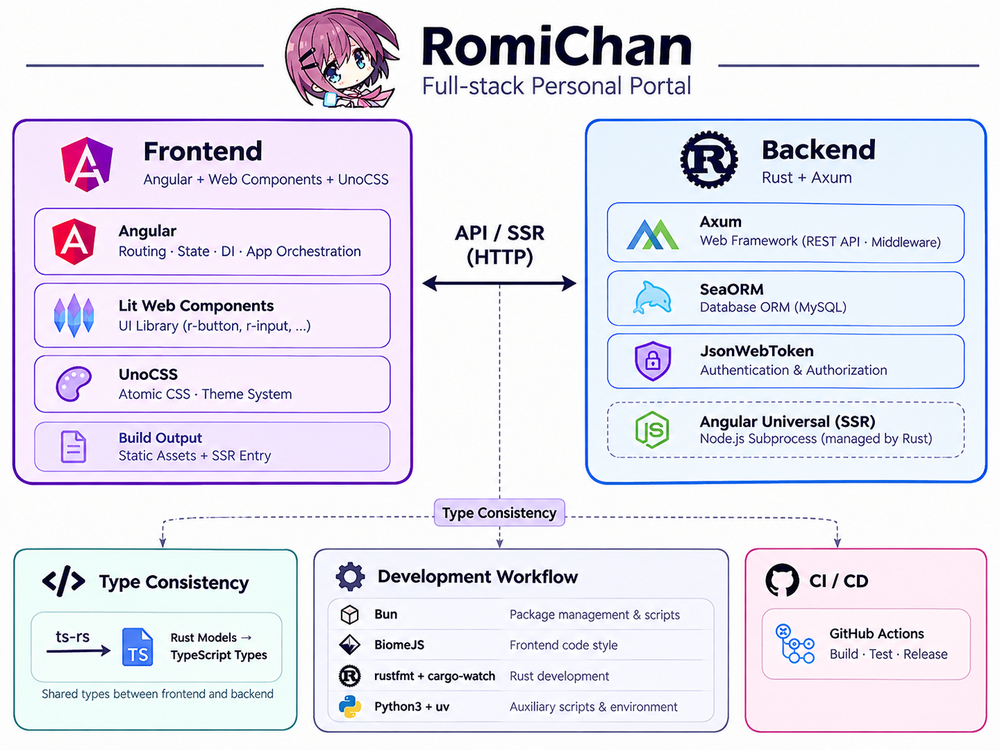

<!-- markdownlint-disable MD013 MD033 MD041 -->

<div align="center">

<a target="_blank" href="https://vndb.org/c90804"></a>

# RomiChan - Personal CMS

**A powerful personal website and CMS running — blog, lists, notes, api, and more. Powered by Axum + Angular.**

RomiChan is the personal website and CMS, built for one person's actual daily use rather than as a generic framework — open-sourced as-is for anyone curious enough to read or self-host it. Powered by Axum + Angular.

[](https://github.com/BIYUEHU/romichan/actions/workflows/build.yml)

[](https://wakatime.com/badge/user/018dc603-712a-4205-a226-d4c9ccd0d02b/project/a2a043a3-ec9d-4fae-b01c-e19ad6eb0011)


[TODO](./TODO.md) | [Romi Nest](https://i.arimuraromi.com)

<span style="color:red;font-weight:bold;font-size:1.5em">Anyone who use ready-made blog frameworks or tools are all idiot without technical power!</span>

</div>

## Features

- **Supports moments, waifu characters, hitokoto, anime, GalGame, movies, and books**
- **Powered by Angular WebComponents + Rust Axum**
- **Full backend user & comment system backed by a robust security system**
- Personal-first: simple but not bare, expressive but not flashy
- A personal portal and expression platform, including a full blog system
- Modern development with Bun, Biome, and UnoCSS
- Guaranteed type consistency between frontend and backend
- Fun color theme system and character birthday reminders

## Public APIs

A set of `/api/utils/*` endpoints are open for general, cross-origin use, alongside the rest of the `/api/*` blog data — random hitokoto, a random QQ avatar or background image proxy, Minecraft server MOTD lookup (Java & Bedrock), Minecraft skin lookup, today's Bing wallpaper, a color preview generator, view-count badges, and a generic HTTP agent proxy.

All public endpoints are rate-limited per IP to keep things fair; expect `429 Too Many Requests` if you exceed the limit.

> [Public API Documentation](https://i.arimuraromi.com/api/)

## Deployment

Please refer to the [Deployment Guide](./DEPLOY.md) for detailed instructions.

## Colors Scheme

```typescript
export const THEME_COLORS = [
  { name: '有村ロミ - Arimura Romi', brand: '#d87cb6', accent: '#9573a2' },
  { name: '姬野星奏 - Himeno Sena', brand: '#E3AD88', accent: 'e8ac96' },
  { name: '美浜羊 - Mihama Hitsuji', brand: '#F7DCFF', accent: '#A881CE' },
  { name: '夏目藍 - Natsume Ai', brand: '#5b8dee', accent: '#3a6fd8' },
  { name: '水無月蛍 - Minazuki Hotaru', brand: '#4caf7d', accent: '#3a9d6e' },
  { name: '遠藤沙弥 - Endou Saya', brand: '#FF9891', accent: '#924376' },
  { name: '七濑步　- Nanase Ayumu', brand: '#B28F96', accent: '#9F8193' },
  { name: '羽音々翼 - Haotone Tsubasa', brand: '#BCE3EA', accent: '#728AB8' }
] as const
```

## Stacks



### Frontend

- Angular
- UnoCSS
- Lit
- Web Components

### Backend

- Axum
- SeaORM
- MySQL
- JsonWebToken

### Workflow

- Node.js
- BiomeJS
- Python3
- Rust
- Git
- GitHub Actions
- rustfmt (nightly)
- cargo-watch: `cargo install cargo-watch`

## Development

```bash
bun install
bun run init  # installs git hooks (lefthook) for lint/format checks
bun run dev
```

## License

Under the `GPL-3.0-or-later` license.
